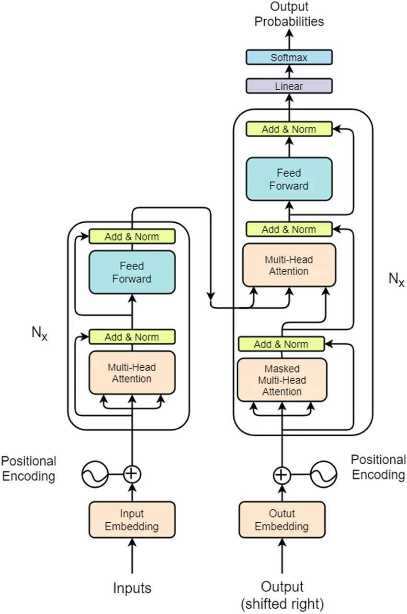
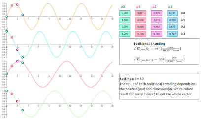

# Phase 1. 모델 입력(Inputs & Positional Encoding)
- 트랜스포머 논문 "Attention is All You Need"의 아키텍처를 보면, 가장 먼저 입력 데이터를 모델이 이해할 수 있는 벡터로 변환하는 과정을 거칩니다.




(Transformer 전체 구조 (논문 원본). 출처: ResearchGate)

## 1. Token Embedding
#### 이론적 배경
- 컴퓨터는 '사과', '바나나' 같은 텍스트를 직접 이해하지 못하므로 이를 숫자(인덱스)로 바꾸고, 다시 이 숫자를 연속적인 실수를 가진 다차원 벡터로 변환해야 합니다. 이를 **임베딩(Embedding)** 이라고 합니다.

- 트랜스포머에서는 임베딩 벡터에 임베딩 차원 크기($d_{model}$)의 제곱근인 $\sqrt{d_{model}}$을 곱해주는 특징이 있습니다. 이는 뒤이어 더해질 Positional Encoding 값(주로 -1 ~ 1 사이)에 비해 임베딩 벡터의 값이 너무 작아져서 의미가 희석되는 것을 방지하기 위함입니다.

```python
import torch
import torch.nn as nn
import math

class TokenEmbedding(nn.Module):
    def __init__(self, vocab_size: int, d_model: int):
        super().__init__()
        # vocab_size: 단어 사전의 크기, d_model: 임베딩 벡터의 차원
        self.embedding = nn.Embedding(vocab_size, d_model)
        self.d_model = d_model

    def forward(self, x):
        # x 차원: (배치 크기, 시퀀스 길이)
        # 임베딩 후 차원: (배치 크기, 시퀀스 길이, d_model)
        return self.embedding(x) * math.sqrt(self.d_model)
```

## 2. Positional Encoding
#### 이론적 배경
- RNN(순환 신경망)은 단어를 순서대로 하나씩 입력받기 때문에 어순 정보를 자연스럽게 알 수 있습니다. 하지만 트랜스포머는 모든 단어를 한 번에 병렬로 입력받습니다. 따라서 "I love you"와 "You love I"를 구분하려면, 단어의 위치(Position) 정보를 인위적으로 주입해야 합니다.

- 논문에서는 사인(Sine)과 코사인(Cosine) 함수의 주기성을 활용하여 위치 정보를 만듭니다.


(주파수가 다른 사인/코사인 곡선. 출처: Kemal Erdem)

- 수식은 다음과 같습니다

$$PE_{(pos, 2i)} = \sin\left(\frac{pos}{10000^{2i/d_{model}}}\right)$$

$$PE_{(pos, 2i+1)} = \cos\left(\frac{pos}{10000^{2i/d_{model}}}\right)$$

  - $pos$: 문장 내에서 단어의 위치 (0, 1, 2...)
  - $i$: 임베딩 벡터 내의 특정 차원 인덱스

- 이 방식은 아날로그 시계의 바늘과 비슷합니다. 초침은 빨리 돌고(고주파수), 시침은 느리게 돕니다(저주파수). 각 차원(바늘)의 값을 조합하면 현재의 정확한 위치(시간)를 유일하게 식별할 수 있으며, 모델이 상대적인 위치 차이를 쉽게 학습할 수 있게 도와줍니다.

```python
class PositionalEncoding(nn.Module):
    def __init__(self, d_model: int, max_len: int = 5000, dropout: float = 0.1):
        super().__init__()
        self.dropout = nn.Dropout(p=dropout)

        # 1. 0으로 채워진 (max_len, d_model) 크기의 행렬 생성
        pe = torch.zeros(max_len, d_model)
        
        # 2. pos를 위한 열 벡터 생성 (0, 1, 2, ..., max_len-1)
        position = torch.arange(0, max_len, dtype=torch.float).unsqueeze(1)
        
        # 3. 10000^(2i/d_model) 항 계산 (exp와 log를 사용해 수치적 안정성 확보)
        div_term = torch.exp(torch.arange(0, d_model, 2).float() * (-math.log(10000.0) / d_model))
        
        # 4. 짝수 인덱스(0, 2, 4...)에는 sin 적용
        pe[:, 0::2] = torch.sin(position * div_term)
        # 5. 홀수 인덱스(1, 3, 5...)에는 cos 적용
        pe[:, 1::2] = torch.cos(position * div_term)
        
        # 배치 연산을 위해 첫 번째 차원 추가: (1, max_len, d_model)
        pe = pe.unsqueeze(0)
        
        # 6. 모델 파라미터가 아닌 버퍼로 등록 
        # (optimizer가 업데이트하지 않지만 state_dict에는 저장됨)
        self.register_buffer('pe', pe)

    def forward(self, x):
        # x는 임베딩을 통과한 텐서: (batch_size, seq_len, d_model)
        # 입력 시퀀스 길이(x.size(1))만큼 pe를 잘라서 더해줌
        x = x + self.pe[:, :x.size(1), :]
        return self.dropout(x)
```

## 3. 테스트 코드
- 지금까지 구현한 TokenEmbedding과 PositionalEncoding이 제대로 작동하는지 Mac의 MPS 가속을 활용해 테스트해 보겠습니다.

```python
# --- Mac OS MPS 환경 설정 ---
device = torch.device('mps' if torch.backends.mps.is_available() else 'cpu')
print(f"Using device: {device}")

# --- 하이퍼파라미터 ---
VOCAB_SIZE = 10000 # 단어 사전 크기
D_MODEL = 512      # 논문과 동일한 임베딩 차원
BATCH_SIZE = 4     # 4개의 문장
SEQ_LEN = 10       # 각 문장은 10개의 단어로 구성

# --- 모듈 초기화 및 디바이스 이동 ---
embed = TokenEmbedding(vocab_size=VOCAB_SIZE, d_model=D_MODEL).to(device)
pe = PositionalEncoding(d_model=D_MODEL).to(device)

# --- 더미 입력 생성 ---
# 0 ~ 9999 사이의 무작위 정수로 이루어진 (4, 10) 형태의 텐서
x = torch.randint(0, VOCAB_SIZE, (BATCH_SIZE, SEQ_LEN)).to(device)
print(f"입력 x 형태: {x.shape}") 

# --- 순전파(Forward Pass) 실행 ---
embedded_x = embed(x)
print(f"임베딩 통과 후 형태: {embedded_x.shape}")

encoded_x = pe(embedded_x)
print(f"위치 인코딩(PE) 통과 후 최종 형태: {encoded_x.shape}")

# 결과물 중 첫 번째 배치, 첫 번째 단어의 처음 5개 차원 값 확인
print("\n첫 번째 단어의 임베딩 + 위치 정보 벡터 (앞 5개 차원):")
print(encoded_x[0, 0, :5])
```

- 위 테스트 코드를 실행하면, 입력 (4, 10)이 임베딩을 거쳐 (4, 10, 512)로 확장되고, Positional Encoding 행렬과 덧셈 연산이 무사히 수행되어 동일한 (4, 10, 512) 형태가 출력됨을 확인할 수 있습니다.
