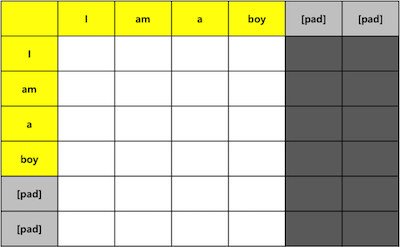
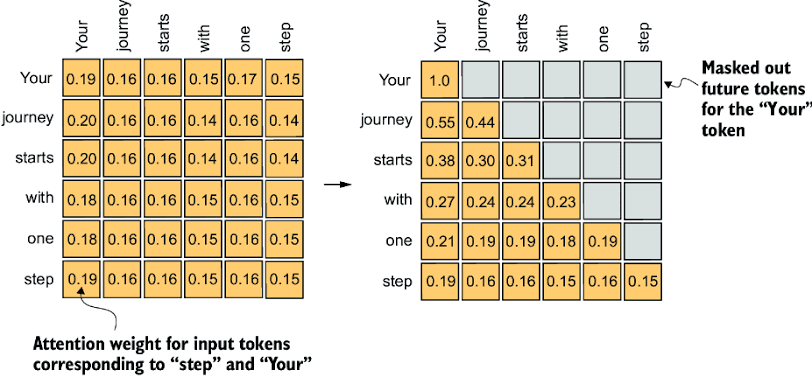

# Phase 2. 마스킹(Masking) 기법
- 트랜스포머에서는 어텐션(Attention) 연산을 수행할 때, 모델이 보지 말아야 할 정보를 가리는 작업이 필수적입니다. 이를 위해 두 가지 종류의 마스크를 사용합니다.

## 1. 패딩 마스크 (Padding Mask)
#### 이론적 배경
- 우리가 모델에 입력하는 문장들의 길이는 제각각입니다. 하지만 GPU(혹은 Mac의 MPS)에서 병렬 처리를 하려면 배치(Batch) 내 모든 문장의 길이를 동일하게 맞춰야 합니다. 이를 위해 가장 긴 문장 길이에 맞춰 짧은 문장의 빈칸을 의미 없는 `<pad>` 토큰(보통 0)으로 채웁니다.

- 문제는 어텐션 메커니즘이 모든 단어 간의 연관성을 계산하기 때문에, 이 의미 없는 `<pad>` 토큰에도 주의(Attention)를 기울이게 된다는 점입니다. 이를 방지하기 위해 패딩 토큰이 있는 위치의 어텐션 스코어를 아주 작은 음수 값(예: `-1e9`)으로 만들어 버립니다. 그러면 소프트맥스(Softmax) 함수를 통과할 때 이 확률 값이 0에 수렴하게 되어 모델이 패딩을 완전히 무시하게 됩니다.


(의미 없는 패딩 토큰을 가리는 패딩 마스트. 출처: Reinforce NLP)

```python
import torch

def create_padding_mask(seq, pad_idx=0):
    """
    입력 시퀀스(seq)에서 pad_idx와 동일한 위치를 0으로, 유효한 단어를 1로 반환합니다.
    (PyTorch 버전에 따라 True/False 형태의 boolean 마스크를 쓰기도 합니다.)
    """
    # seq 형태: (batch_size, seq_len)
    
    # 패딩이 아닌 유효한 토큰의 위치를 True(또는 1)로 만듭니다.
    mask = (seq != pad_idx).unsqueeze(1).unsqueeze(2) 
    # mask 형태: (batch_size, 1, 1, seq_len)
    # 중간에 1차원 두 개를 추가하는 이유는 이후 Multi-Head Attention 연산 시
    # 헤드(Head) 차원과 쿼리(Query)의 시퀀스 길이에 맞게 브로드캐스팅(Broadcasting)하기 위함입니다.
    
    return mask
```

## 2. 인과적 마스크 (Causal Mask / Look-ahead Mask)
#### 이론적 배경
- 디코더(Decoder)에서 문장을 생성할 때는 순차적으로 단어를 하나씩 내뱉습니다(Auto-regressive). 예를 들어, "I", "am", "a", "student"를 번역할 때, "am"을 예측하는 시점에서는 과거에 생성한 "I"까지만 봐야지 미래의 정답인 "a"나 "student"를 미리 보면 안 됩니다. (이것을 컨닝이라고 부릅니다.)

- 그래서 대각선 위쪽(미래의 정보)을 모두 가려버리는 **하삼각행렬(Lower Triangular Matrix)** 형태의 마스크를 생성합니다.


(미래 정보를 차단하는 인과적 마스크. 출처: Medium)

```python
def create_causal_mask(seq_len, device):
    """
    미래의 토큰을 보지 못하도록 대각선 아래쪽만 1(또는 True)로 채워진 하삼각행렬 마스크를 생성합니다.
    """
    # torch.tril은 행렬의 대각선 윗부분을 0으로 만듭니다 (하삼각행렬)
    mask = torch.tril(torch.ones((seq_len, seq_len), device=device)).bool()
    
    # mask 형태: (seq_len, seq_len)
    # 디코더의 모든 배치와 모든 헤드에 동일하게 적용되므로 배치 차원은 생략 가능합니다.
    return mask
```

## 3. 테스트 코드
- 이 두 가지 마스크가 디코더에서는 결합(Intersection)되어 사용됩니다. 즉, 패딩 토큰도 보면 안 되고, 미래의 토큰도 보면 안 됩니다. 이를 결합하는 테스트 코드를 작성해 보겠습니다.

```python
# --- Mac OS MPS 환경 설정 ---
device = torch.device('mps' if torch.backends.mps.is_available() else 'cpu')

# --- 더미 데이터 설정 ---
PAD_IDX = 0
# 2개의 문장, 시퀀스 길이는 5라고 가정 (0은 패딩 토큰)
decoder_input = torch.tensor([
    [5, 12, 4, 0, 0],  # 첫 번째 문장은 뒤에 2개의 패딩이 있음
    [7, 9, 15, 3, 0]   # 두 번째 문장은 뒤에 1개의 패딩이 있음
], device=device)

batch_size, seq_len = decoder_input.size()

print("=== 1. 패딩 마스크 (Padding Mask) ===")
pad_mask = create_padding_mask(decoder_input, pad_idx=PAD_IDX)
# 가독성을 위해 마지막 2차원(seq_len, seq_len) 형태로 변환해서 출력
print(pad_mask[0, 0, :]) # 첫 번째 문장의 마스크 모양: [True, True, True, False, False]

print("\n=== 2. 인과적 마스크 (Causal Mask) ===")
causal_mask = create_causal_mask(seq_len, device=device)
print(causal_mask)

print("\n=== 3. 디코더 최종 마스크 (Padding + Causal) ===")
# 디코더에서는 이 둘을 논리적 AND(&) 연산으로 결합하여 사용합니다.
decoder_mask = pad_mask & causal_mask
print("첫 번째 문장의 최종 디코더 마스크:")
print(decoder_mask[0, 0])
```

- 테스트를 실행해보면, 첫 번째 문장의 디코더 마스크는 대각선 윗부분(미래)이 `False`로 가려져 있고, 동시에 마지막 2개의 열(패딩 부분)도 세로로 길게 `False`로 가려져 있는 멋진 행렬을 볼 수 있습니다.