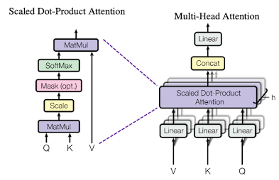

# Phase 3. Attention Mechanism
- Attention Mechanism은 트랜스포머의 심장이라고 할 수 있습니다. 어텐션은 문장 내의 단어들이 서로 얼마나 연관되어 있는지를 계산하여 문맥을 파악하는 역할을 합니다.


(어텐션 메커니즈 구조. 출처: 논문 원본)

## 1. 스케일드 닷 프로덕트 어텐션 (Scaled Dot-Product Attention)
#### 이론적 배경
- 어텐션은 기본적으로 Query(Q), Key(K), Value(V) 세 가지 벡터를 사용합니다. 데이터베이스의 검색 시스템과 비슷합니다.
1. 찾고자 하는 정보(Query)를 검색어(Key)들과 비교(내적, Dot Product)하여 유사도를 구합니다.
2. 차원이 커지면 내적 값이 너무 커져 Softmax 함수의 기울기 소실(Vanishing Gradient) 문제가 발생하므로, Key 벡터 차원의 제곱근($\sqrt{d_k}$)으로 나누어 스케일링(Scaling)을 합니다.
3. 2단계에서 만든 마스크(Mask)가 있다면 적용하여 불필요한 연산을 가립니다.
4. Softmax를 취해 가중치를 0~1 사이의 확률값으로 만들고, 이를 Value(V)와 곱해 최종 결과값을 얻습니다.

- 수식으로는 다음과 같습니다.

$$Attention(Q, K, V) = softmax\left(\frac{QK^T}{\sqrt{d_k}}\right)V$$

```python
import torch
import torch.nn as nn
import math
import torch.nn.functional as F

def scaled_dot_product_attention(q, k, v, mask=None, dropout_layer=None):
    """
    q, k, v 차원: (batch_size, num_heads, seq_len, d_k)
    """
    # Key의 마지막 두 차원을 전치(Transpose)하여 Query와 행렬 곱(Dot Product)을 수행
    # 결과 차원: (batch_size, num_heads, seq_len, seq_len)
    d_k = q.size(-1)
    scores = torch.matmul(q, k.transpose(-2, -1)) / math.sqrt(d_k)
    
    # 마스크가 존재할 경우, 마스크가 False(또는 0)인 부분을 -1e9(매우 작은 수)로 채움
    if mask is not None:
        scores = scores.masked_fill(mask == 0, -1e9)
        
    # Softmax를 적용하여 확률값(Attention Weights) 생성
    p_attn = F.softmax(scores, dim=-1)
    
    if dropout_layer is not None:
        p_attn = dropout_layer(p_attn)
        
    # 최종적으로 Value와 행렬 곱
    # 결과 차원: (batch_size, num_heads, seq_len, d_k)
    return torch.matmul(p_attn, v), p_attn
```

## 2. 멀티 헤드 어텐션 (Multi-Head Attention)
#### 이론적 배경
- 단어들 사이의 관계는 한 가지 관점으로만 파악하기 어렵습니다. 예를 들어 "The animal didn't cross the street because it was too tired"라는 문장에서 'it'이 animal인지 street인지 파악하려면 문법적, 의미론적 등 다양한 시각이 필요합니다.

- 멀티 헤드 어텐션은 전체 임베딩 차원($d_{model}$)을 여러 개의 헤드(Head)로 쪼개어 각각 병렬로 어텐션을 수행(다양한 관점으로 문장을 분석)한 뒤, 결과를 다시 하나로 합칩니다(Concatenation).

```python
class MultiHeadAttention(nn.Module):
    def __init__(self, d_model: int, num_heads: int, dropout: float = 0.1):
        super().__init__()
        
        # d_model은 num_heads로 나누어 떨어져야 합니다.
        assert d_model % num_heads == 0
        
        self.d_model = d_model
        self.d_k = d_model // num_heads
        self.num_heads = num_heads
        
        # Q, K, V를 위한 선형 변환 레이어
        self.W_q = nn.Linear(d_model, d_model)
        self.W_k = nn.Linear(d_model, d_model)
        self.W_v = nn.Linear(d_model, d_model)
        
        # 여러 헤드의 결과를 합친 후 통과시킬 최종 선형 레이어
        self.W_o = nn.Linear(d_model, d_model)
        
        self.dropout = nn.Dropout(p=dropout)
        
    def forward(self, q, k, v, mask=None):
        batch_size = q.size(0)
        
        # 1. Q, K, V에 각각 선형 변환을 적용하고, 헤드 수만큼 차원을 분리합니다.
        # view 적용 후: (batch_size, seq_len, num_heads, d_k)
        # transpose 적용 후: (batch_size, num_heads, seq_len, d_k)
        query = self.W_q(q).view(batch_size, -1, self.num_heads, self.d_k).transpose(1, 2)
        key   = self.W_k(k).view(batch_size, -1, self.num_heads, self.d_k).transpose(1, 2)
        value = self.W_v(v).view(batch_size, -1, self.num_heads, self.d_k).transpose(1, 2)
        
        # 2. 스케일드 닷 프로덕트 어텐션 수행
        x, attn_weights = scaled_dot_product_attention(query, key, value, mask, self.dropout)
        
        # 3. 쪼개졌던 헤드들을 다시 하나로 합칩니다.
        # transpose 및 contiguous 수행 후: (batch_size, seq_len, num_heads, d_k)
        # view 수행 후: (batch_size, seq_len, d_model)
        x = x.transpose(1, 2).contiguous().view(batch_size, -1, self.num_heads * self.d_k)
        
        # 4. 최종 선형 변환
        return self.W_o(x)
```

## 3. 테스트 코드
- 지금까지 구현한 Multi-Head Attention이 입력 텐서 차원을 제대로 유지하는지, 그리고 2단계에서 배운 패딩 마스크를 어떻게 받아서 처리하는지 확인해 보겠습니다.

```python
# --- Mac OS MPS 환경 설정 ---
device = torch.device('mps' if torch.backends.mps.is_available() else 'cpu')

# --- 하이퍼파라미터 ---
D_MODEL = 512
NUM_HEADS = 8
BATCH_SIZE = 2
SEQ_LEN = 5

# 모듈 초기화 및 디바이스 이동
mha = MultiHeadAttention(d_model=D_MODEL, num_heads=NUM_HEADS).to(device)

# --- 더미 데이터 ---
# 셀프 어텐션(Self-Attention)의 경우 Q, K, V가 모두 동일한 입력에서 옵니다.
dummy_input = torch.randn(BATCH_SIZE, SEQ_LEN, D_MODEL).to(device)

# 2단계에서 구현한 패딩 마스크의 단순화 버전 (앞의 3개 단어만 유효, 뒤 2개는 패딩이라 가정)
# 마스크 차원: (batch_size, 1, 1, seq_len) - 헤드 차원 브로드캐스팅을 위해 1, 1 추가
dummy_mask = torch.tensor([
    [1, 1, 1, 0, 0],
    [1, 1, 1, 1, 0]
], dtype=torch.bool, device=device).unsqueeze(1).unsqueeze(2)

print(f"입력 차원: {dummy_input.shape}")
print(f"마스크 차원: {dummy_mask.shape}")

# 순전파 실행
output = mha(dummy_input, dummy_input, dummy_input, dummy_mask)

print(f"출력 차원: {output.shape}") 
# 기대 결과: torch.Size([2, 5, 512]) -> 입력과 동일한 차원을 유지해야 합니다.
```

